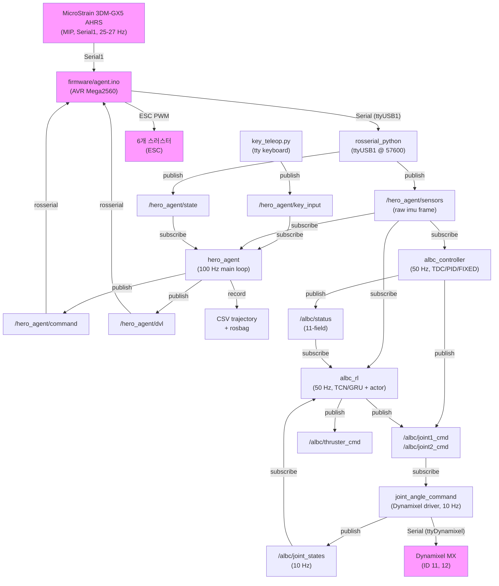
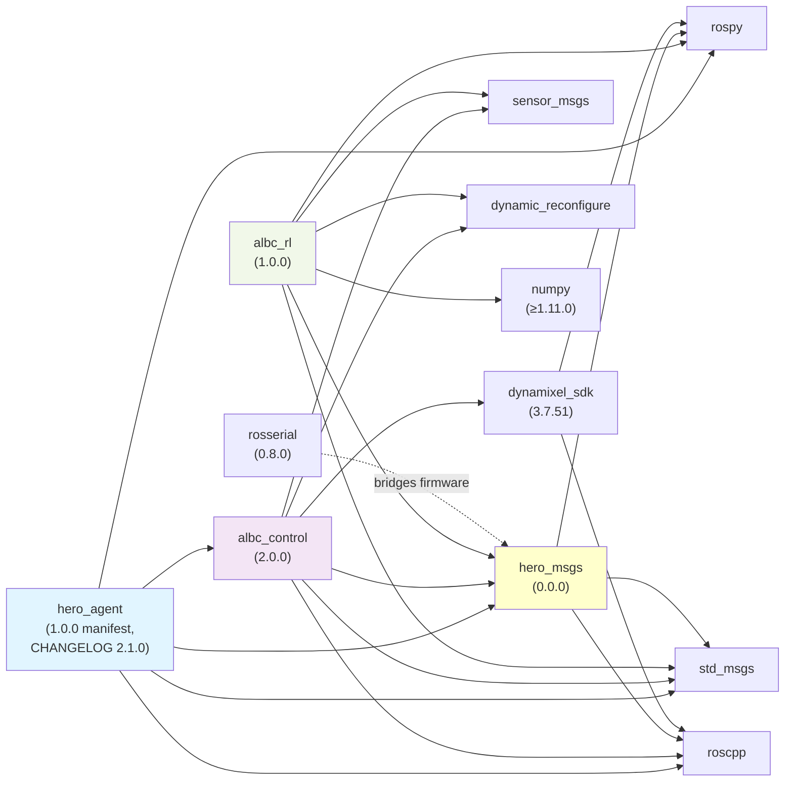

# agent-jetson 로봇 스택 아키텍처

> **기준 트리**: 브랜치 `refactor/cleanup-2026-09` (base `90b13e4`, 커밋 12개).
> 이 브랜치는 **아직 `deploy/72d-inc9998-gru` 로 병합되지 않았고 보드에도 안 올라갔다** —
> 선행 조건은 `bash tests/board_gate.sh` → `BOARD_GATE: PASS` 이고 보드 미접속으로 미실행이다.
> 패키지별 변경 이력은 각 `CHANGELOG.md` 의 `[Unreleased]` 항목, 결정 근거는 `docs/adr/`.

## 1. 개요

**agent-jetson**은 NVIDIA Jetson TX2 보드에서 실행되는 UUV(무인수중선) 자세 제어 및 조작 플랫폼이다. 이 스택은 4개 ROS 패키지로 구성되어 있다: (1) **hero_msgs** — 공유 메시지 정의 및 메시지 생명주기 관리, (2) **hero_agent** — 키보드 텔레오프 + 상태 모니터링 + 궤적 로깅 (50 Hz CSV, rosbag), (3) **albc_control** — 저수준 자세 피드백 제어 + 2-DOF 팔 역기구학 + Dynamixel 드라이버, (4) **albc_rl** — 50 Hz로 실행되는 RL 정책 추론 (torch-free numpy 순전파, 72D 정책 관측, 6개 스러스터 + 2개 팔 관절 명령). 이 파이프라인은 MicroStrain 3DM-GX5 AHRS(MIP 프로토콜, IMU 자이로 포함) → rosserial 브릿지 → ROS 토픽 → 자세 제어기 또는 RL 정책 → Dynamixel 팔 드라이버 + ESC 스러스터 혼합기로 이어진다.



---

## 2. 패키지 아키텍처

### 2.1 hero_msgs

**목적**: 펌웨어, ROS, RL 노드 간 공유 메시지 정의 및 ABI 계약. 

**책임**:
- 9개 custom ROS message 타입 정의 (hero_agent_sensor, hero_agent_state, hero_agent_dvl 등)
- 메시지 생명주기 관리 (ACTIVE / DEPRECATED classification)
- 펌웨어 ros_lib 스텁 생성을 위한 소스 (rosserial_arduino)

**핵심 파일**:

| 파일 | 역할 | 라인 |
|:---|:---|:---:|
| `msg/hero_agent_sensor.msg` | ROLL, PITCH, YAW, DEPTH, GYRO_X/Y/Z (28 bytes) | 8 |
| `msg/hero_agent_state.msg` | 펌웨어 상태 (Yaw, Depth, State_addit bitfield) | 7 |
| `msg/hero_agent_dvl.msg` | 텔레오프 3축 목표 (TARGET_X/Y/Z) | 4 |
| `NAMING_CONVENTION.md` | REP-103/135/145 기반 메시지 명명 SSOT | 178 |
| `CMakeLists.txt` | message_generation 선언 | 27 |

**공개 인터페이스**:
- `hero_agent_sensor` — raw imu frame (모든 소비자가 rotate_imu 적용 필요)
- `hero_agent_state` — 펌웨어 상태 (Yaw, Depth, 제어 플래그 bitfield)
- `hero_agent_dvl` — 텔레오프 누적 목표

**내부 설계**:
메시지 스키마는 순수 평탄 구조(nested 타입 없음), little-endian ROS 표준. 각 .msg 파일은 catkin message_generation을 트리거하여 devel/include/hero_msgs/*.h (C++), devel/lib/python*/dist-packages/hero_msgs/*.py (Python), 그리고 firmware rosserial 스텁을 생성한다. 2022 DVL/darknet 유산 메시지 5종 + srv 1종(`hero_agent_cont_para`·`hero_agent_cont_xy`·`hero_agent_dvl_velocity`·`hero_agent_position_result`·`hero_xy_cont`·`hero_command.srv`)과 `hero_agent_vision.msg` 는 2026-09-04 정리에서 **삭제됐다**(`274b192`·`654e215`) — 그 구독자·콜백이 펌웨어에서 같이 사라졌기 때문이다. 남은 .msg 는 4종(`hero_agent_sensor`·`hero_agent_state`·`hero_agent_dvl`·`hero_agent_thruster_cmd`).

**강점**:
- REP 표준 기반 명명 규칙 문서화
- 메시지 생명주기 명시적 관리 (ACTIVE/DEPRECATED)
- 펌웨어-ROS ABI 계약 명확화

**우려사항**:
- 설명자 버전 관리 없음 (필드 순서만 스키마)
- hero_msgs 자체는 placeholder 0.0.0 버전
- 9개 메시지 중 일부는 사용되지 않지만 펌웨어 ros_lib로 인해 유지됨

---

### 2.2 hero_agent

**목적**: 키보드 텔레오프 통합 + 로봇 상태 모니터링 + 궤적 로깅 (CSV 50 Hz, rosbag 5 토픽).

**책임**:
- 키보드 입력 allow-list 필터링 (KEYMAP SSOT)
- 펌웨어 명령 문자 생성 (fw_char dispatch)
- 텔레오프 목표 누적 (w/s/a/d/r/f 키 처리, 무상태 TeleopController)
- 로봇 상태 모니터링 및 캐싱 (yaw, depth, IMU with 45° 회전)
- 100 Hz 터미널 UI 모니터 렌더링
- CSV 궤적 로깅 (17-col, 고정 헤더, 50 Hz)
- Rosbag 텔레메트리 기록 (5 토픽, fork/exec/signal 정리)

**핵심 파일**:

| 파일 | 역할 | 라인 |
|:---|:---|:---:|
| `src/agent.cpp` | 메인 노드: 100 Hz 루프, CSV/rosbag 세션 제어 | 297 |
| `include/hero_agent/keymap.h` | Allow-list SSOT: 24 키, 토글 플래그, fw_char | 59 |
| `include/hero_agent/key_translator.h` | 순수 함수: KEYMAP → fw_char + action | 19 |
| `include/hero_agent/teleop_controller.h` | 상태 누적기: x/y/z 목표 증분 | 42 |
| `include/hero_agent/state_monitor.h` | 콜백 핸들러 + 캐시, IMU 프레임 회전 | 161 |
| `include/hero_agent/csv_logger.h` | 파일 I/O, 각 쓰기마다 flush | 93 |
| `include/hero_agent/rosbag_recorder.h` | rosbag record 서브프로세스 관리 | 84 |
| `scripts/key_teleop.py` | tty raw mode 키보드 reader | 85 |
| `config/agent.yaml` | 루프 레이트, CSV 레이트, debounce | 22 |
| `launch/agent_launch.launch` | UVC camera, rosserial, agent, key_teleop 시작 | 36 |

**공개 인터페이스**:

| 인터페이스 | 방향 | 타입 / 시그니처 |
|:---|:---|:---|
| `/hero_agent/key_input` | in | std_msgs/Int8 |
| `/hero_agent/state` | in | hero_msgs/hero_agent_state |
| `/hero_agent/sensors` | in | hero_msgs/hero_agent_sensor |
| `/albc/status` | in | std_msgs/Float64MultiArray[11] |
| `/hero_agent/command` | out | std_msgs/Int8 (fw_char) |
| `/hero_agent/dvl` | out | hero_msgs/hero_agent_dvl |
| `teleop/z_step` | param | double (default 0.01 m) |
| `loop_rate_hz` | param | int (default 100) |
| `csv_rate_hz` | param | int (default 50) |
| `debounce_sec` | param | double (default 0.5) |
| `results_dir` | param | string |
| `/albc_controller/imu_yaw_offset` | param (cross-read) | double (default 45.0°) |

**내부 설계**:
v2.0.0 단일-노드 재설계 (이전 3-노드 파이프라인 병합). 제어 흐름: key_teleop.py → Int8 → agent.cpp key_input_callback (allow-list KEYMAP 조회, debounce 게이트) → fw_char 또는 번역된 action (TeleopController 인프로세스, 주제 왕복 없음; **heave 축만** — w/s/a/d는 `translated=0`으로 fw_char 직행이라 xy 분기가 도달 불가였고 `9471176`에서 제거됐다). 100 Hz 메인 루프: 타겟 dirty 플래그 설정 시 /hero_agent/dvl 발행, csv_rate_hz에서 CSV 쓰기 (50 Hz 기본값), `log_period`(agent.yaml 기본 0.5 s)마다 모니터 렌더링 — 이전엔 루프율 100 Hz로 전체 재그리기 했다(`9471176`). AsyncSpinner(2)는 4개 구독자 (key_input, state, sensors, /albc/status) 처리. 동기화: atomic<bool> g_target_dirty (lock-free), std::mutex for CSV/ALBC 캐시, per-char debounce via ros::Time[256] 배열. StateMonitor는 imu_yaw_offset 파람(**현행 102.0°**, 45.0 은 2026-08-12에 폐기)으로 albc_control의 `rotateImu()` 오라클을 호출한다 — 인라인 사본은 제거됐다(`466006c`). RosbagRecorder는 rosbag record를 fork/exec, 5개 토픽 기록, SIGTERM→poll(30×100ms)→SIGKILL으로 정리, .active 이름 변경. CSV 로거는 17-col 고정 헤더로 각 쓰기마다 flush. KEYMAP은 24개 항목 allow-list SSOT; 미등록 키는 drop.

**데이터 계약**:
- hero_agent_sensor: ROLL, PITCH, YAW (rad), DEPTH, GYRO_X/Y/Z (rad/s)
- /hero_agent/command: fw_char (ASCII, R/Y/D/L/w/s/a/d 등)
- /hero_agent/dvl: TARGET_X/Y/Z (cumulative, m)
- CSV 17-col: ros_time, ALBC[0:11], depth_target/current, IMU roll/pitch/yaw

**강점**:
- Allow-list 안전성: KEYMAP SSOT (v2.1.0 이후 미등록 키 통과 불가)
- 단일 노드 통합: TeleopController 인프로세스 (v2.0.0+)
- 선언적 keymap: 테이블 주도 설계, 도움말 자동 생성
- 책임 분리: StateMonitor, CsvLogger, RosbagRecorder 클래스 분리
- Atomic & mutex 보호: g_target_dirty lock-free, CSV/ALBC 데이터 mutex
- 파라미터 외부화: agent.yaml SSOT

**우려사항**:
- characterization 테스트는 존재(`tests/characterization/`, keymap·key_translation·control_law 등 박제)하나 catkin 빌드 미통합 — `catkin_make run_tests`로 안 돌고 CI 없음 (6.2 우선순위 2 참조)
- 'R' (CSV 토글) 키가 KEYMAP 외부에서 특수 처리됨 (agent.cpp:113-117), 대칭성 위반
- 로깅 디렉토리 레이스 조건: 같은 results_dir의 두 agent가 동일 인덱스 계산 (파일 잠금 없음)
- Rosbag fork 실패 경로: execlp 실패 시 errno 손실

---

### 2.3 albc_control

**목적**: 저수준 자세 피드백 제어 + 2-DOF 팔 역기구학 + IMU 처리. **ALBC**(Active Link Buoyancy Control)는 관성 센서 기반 자세 추종을 위한 Dynamixel 조작기이다.

**책임**:
- 자세 피드백 제어 (TDC/PID/FIXED/MANUAL 4가지 모드)
- 댐핑 최소제곱(DLS) 역기구학 솔버
- Dynamixel 팔 드라이버 (ID 11, 12)
- /albc/status 상태 브로드캐스트 (11-field 계약)
- 동적 재설정 (control_law.h, feedback_filters.h 오라클은 바이트-일치)
- 터미널 UI 대시보드 + 키보드 모드 전환

**핵심 파일**:

| 파일 | 역할 | 라인 |
|:---|:---|:---:|
| `src/albc_controller.cpp` | 메인 제어 루프 (50 Hz, 345 LOC) | 345 |
| `src/joint_angle_command.cpp` | Dynamixel 드라이버 + /albc/joint_states 발행 | 354 |
| `include/albc_control/attitude_controller.h` | 4-모드 제어 법칙 + 피드백 파이프라인 | 250 |
| `include/albc_control/inverse_kinematics.h` | DLS IK 솔버 캡슐화 | 95 |
| `include/albc_control/mode_manager.h` | FSM + 터미널 raw-mode I/O | 250 |
| `include/albc_control/imu_processor.h` | IMU 콜백, yaw 오프셋 회전 | 53 |
| `include/albc_control/status_publisher.h` | /albc/status 발행 (11-field 계약) | 83 |
| `include/albc_control/control_law.h` | 오라클: 4-모드 제어 법칙 (바이트-일치) | 114 |
| `include/albc_control/feedback_filters.h` | 오라클: integral anti-windup + damping gate | 80 |
| `include/albc_control/dls_ik.h` | 오라클: DLS IK 스텝 (바이트-일치) | 92 |
| `include/albc_control/imu_rotation.h` | 오라클: IMU yaw-offset 회전 (PITCH 부호 고정) | 46 |
| `include/albc_control/albc_kinematics.h` | 순수 기구학: forward FK, Jacobian | 59 |
| `config/albc_controller.yaml` | 게인 기본값 SSOT, 50 Hz, yaw offset 45° | 50 |
| `cfg/ALBCController.cfg` | dynamic_reconfigure 인터페이스 (22 param) | 54 |
| `launch/albc.launch` | roslaunch 파일, 파라미터 구동 모드 | 13 |

**공개 인터페이스**:

| 인터페이스 | 방향 | 타입 / 시그니처 |
|:---|:---|:---|
| `/hero_agent/sensors` | in | hero_msgs/hero_agent_sensor |
| `/albc/status` | out | std_msgs/Float64MultiArray[11] |
| `/albc/joint1_cmd`, `/albc/joint2_cmd` | out | std_msgs/Float64 (rad, mapTo2Pi) |
| `/albc/joint_states` | out | sensor_msgs/JointState |
| `/albc/joint_currents` | in | std_msgs/Float32MultiArray |
| `/albc_controller/imu_yaw_offset` | param | double (default 45.0°, 공유) |
| `/albc_controller/control_mode` | param | int (1=TDC, 2=PID, 3=FIXED, 4=MANUAL) |
| `/albc_controller/loop_rate_hz` | param | int (default 50) |
| `/albc_controller/*` | param | double (gain 기본값) |
| `/dynamic_reconfigure` (ALBCControllerConfig) | service | 런타임 튜닝 |

**내부 설계** (v2.0.0 composition 재설계):
메인 루프 (albc_controller.cpp:262-341)는 6개 클래스를 50 Hz에서 오케스트레이션: (1) ModeManager (FSM + 터미널 raw-mode), (2) ImuProcessor (/hero_agent/sensors 구독, rotate_imu 오라클 위임), (3) AttitudeController (오류 → integralStep freeze/clamp → dampedDerivative gate/LPF → computeControlOutputOracle 4-모드 스위치), (4) InverseKinematics (DLS loop + radial saturation), (5) StatusPublisher (11-field /albc/status), (6) JointCurrentMonitor (/albc/joint_currents 캐시). 모든 제어 수학은 바이트-일치 오라클 (control_law.h, feedback_filters.h, dls_ik.h, imu_rotation.h)에 위임 — 재구현 없음. 모터 드라이버 (joint_angle_command.cpp): 10 Hz 루프, Dynamixel SDK, 시작 ramp (20 RPM × 5s), 측정 위치 누적 + 속도 미분 (true dt), RL 배포 게이트 (queue_size=1, 읽기 실패 시 발행 스킵).

**데이터 계약**:
- 자세: [roll, pitch, yaw] (rad, body-frame FRD)
- EE 위치: [x, y] (m)
- 관절 각도: [theta1, theta2] (rad, cumulative)
- 모터 위치: 2048 ticks = π rad (MX encoder 4096/rev)
- /albc/status: [0-3] attitude deg (RAD2DEG), [4-7] EE x/y m, [8-10] angular vel rad/s

**강점**:
- 바이트-일치 동작 보존 (모든 제어 수학이 ROS-free 오라클)
- 깔끔한 관심사 분리 (6개 SRP 클래스)
- 제어 법칙 부호 고정 (TDC, PID, FIXED의 모든 Fb/Ki/Kd 상수 동결)
- RL 추론 통합 (/albc/joint_states 발행, queue_size=1 stale-burst 게이트, 실패 시 스킵)
- 터미널 견고성 (raw-mode termios + atexit() 가드)

**우려사항**:
- 매직 숫자 흩어짐: COMMON_FACTOR_MAX=10.0, LEVEL_THRESHOLD=0.01745, FIXED_ALPHA=0.05, IK_DELTA_THRESHOLD=0.01 (헤더에 하드코딩)
- 제어 법칙의 고정된 부호: TDC dy/dx 부호, PID pitch 부호, PITCH raw 부호 (변경 시 침묵 동작 변경)
- C++ 제어 코어 (~2000 LOC) 단위 테스트 부재
- 속도 미분 불일치: 관절 드라이버는 측정 dt 사용, 자세 제어기는 고정 dt=1/50 (드리프트 가능)
- IK 수렴 open-loop: 고정 반복 실행, max-error 게이트 없음
- /albc/status 필드 순서 취약성: 3곳에 동결됨 (코멘트만, 스키마 검증 없음)

---

### 2.4 albc_rl

**목적**: agent-jetson TX2 보드에서 50 Hz로 RL 학생 정책 추론 실행 (torch-free numpy 순전파). 72D 자세-only 정책에서 관찰 → 8D 액션 (2개 팔 관절 + 6개 스러스터).

**책임**:
- IMU (오일러 + 자이로) 수신 → rotate_imu/rotate_gyro로 보드-프레임 보정
- 관절 상태 (위치 + 속도) 10 Hz 드라이버에서 수신
- 20D proprioception 블록 조립 (ProprioBuilder.build)
- 46D temporal history (stride=3) + 3D leaky gated integral + 3D ungated bias EMA 보유
- 72D 정책 순전파 (TCN/GRU encoder + teacher actor, numpy npforward)
- 절대 누적 관절 PD 목표 발행 (/albc/joint1_cmd, /albc/joint2_cmd)
- 스러스터 명령 발행 (8D 액션의 action[2:8] → /albc/thruster_cmd[0:6], 안전-모드 스케일 기본 0.0)
- IMU staleness gate (기본 0.2s), 관절 상태 staleness gate (0.5s)

**핵심 파일**:

| 파일 | 역할 | 라인 |
|:---|:---|:---:|
| `scripts/rl_inference_node.py` | ROS 노드: 50 Hz 타이머, 상태 보유 | 826 |
| `scripts/thruster_mixer.py` | ROS 노드: 8D 액션 → ESC 채널 (불감대 역보정·3채널 재배분) | 473 |
| `src/albc_rl/contract.py` | **동결 계약 SSOT**: 차원·상수·`TOPICS` | 52 |
| `src/albc_rl/build_proprio.py` | 센서 surface: 20D proprioception 어셈블러 | 278 |
| `src/albc_rl/np_policy.py` | 정책 런타임: obs 어셈블리, history buffer | 323 |
| `src/albc_rl/npforward.py` | torch-free 순전파: Conv1d, GRU, LayerNorm | 183 |
| `src/albc_rl/arm_guard.py` | 관절 전류 지속 캡 + 래치 | 74 |
| `scripts/test_build_proprio.py` | 테스트: 39 passed | 444 |
| `scripts/test_deploy_constants.py` | 테스트: 배포 상수·토픽 SSOT 파리티, 21 passed | 677 |
| `numpy_port/test_*.py` | 테스트: golden vector 검증 (배포 팩 안), 15 passed / 2 xfailed | 334 |

> **`src/` 와 `numpy_port/` 의 경계** (T3, D3). `src/albc_rl/` 는 **보드 코드** — catkin
> python 패키지(`setup.py` + `catkin_python_setup()`)라 `from albc_rl import ...` 로 잡히고
> `sys.path` 해킹이 없다. `numpy_port/` 는 이제 **배포 팩** 전용 —
> `weights_*.npz`·`golden/`·`MANIFEST.*.json`. 팩을 통째로 갈아끼워도 정책 런타임이 같이
> 날아가지 않는다.
| `cfg/GyroOffset.cfg` | dynamic_reconfigure: IMU yaw offset 튜닝 | 10 |
| `launch/albc_rl.launch` | 독립 실행 (정책 + 믹서) | 43 |
| `launch/albc_rl_fieldtest.launch` | 필드 테스트 번들 (joint_driver + rosbag) | 110 |

**공개 인터페이스**:

| 인터페이스 | 방향 | 타입 / 시그니처 |
|:---|:---|:---|
| `/hero_agent/sensors` | in | hero_msgs/hero_agent_sensor (raw imu frame) |
| `/albc/joint_states` | in | sensor_msgs/JointState (10 Hz driver) |
| `/albc/status` | in | std_msgs/Float64MultiArray (data[8:11] if use_board_rates) |
| `/albc/rl_command` | in | std_msgs/Float32MultiArray (att cmd) |
| `/albc/joint1_cmd`, `/albc/joint2_cmd` | out | std_msgs/Float64 (절대 누적 PD) |
| `/albc/thruster_cmd` | out | std_msgs/Float32MultiArray[6] |
| `~encoder_type` | param | string ('tcn' \| 'gru', default 'tcn') |
| `~weights_dir` | param | string (default ../numpy_port) |
| `~control_hz` | param | float (default 50.0) |
| `~use_board_rates` | param | bool (true ⇒ obs[6:9] from /albc/status[8:11]). ⚠️ RL 구성에선 albc_controller가 안 떠서 **발행자가 없다** — CLI 호환 때문에 유지(D7) |
| `~imu_yaw_offset_deg` | param | float (default **102.0**, live-tunable). 45.0 → −78.0 → 102.0, 2026-08-12 확정 |
| `~sensor_timeout_s` | param | float (default 0.2) |
| `~joint_timeout_s` | param | float (default 0.5) |
| `~thruster_scale` | param | float (default 0.0 FAIL-SAFE) |
| `~thruster_max_s` | param | float (optional auto-latch) |

**내부 설계**:
**제어 루프** (50 Hz 타이머, RLInferenceNode._tick): 각 타이머 이벤트에서 staleness 게이트 확인 (IMU < 0.2s, joints < 0.5s), ProprioBuilder.build로 20D proprioception 어셈블, NumpyStudentPolicy.act(proprio_20, cmd_3)으로 8D 액션 획득, 관절 목표 (절대, 누적 PD) + 스러스터 명령 (스케일됨) 발행, 1 Hz loginfo로 타이밍/상태 기록.

**센서 어셈블리** (ProprioBuilder): raw board-frame 보정 센서 dict를 20D proprioception [0:3]=command, [3:6]=오일러, [6:9]=각속도 (펌웨어 자이로 passthrough 또는 오일러-diff+LPF fallback), [9:11]=관절 위치, [11:13]=관절 속도 (드라이버 또는 self-diff+LPF), [13]=manipulability, [14:20]=스러스터 echo로 매핑. 호출 간 rate estimator 보유 (이전 오일러, 이전 관절 각도, LPF 상태).

**정책 런타임** (NumpyStudentPolicy): .npz 가중치 (학생 + 교사)를 TCN 또는 GRU encoder + TeacherActor로 로드. 각 act() 호출에서 72D obs = [proprio_20 + jb_hist_30 + act_hist_16 + integral_3 + bias_ema_3] 어셈블. History buffer는 stride-3 링 (3-step window = 18D/step). Integral은 3D leaky gated on [roll_att_err, pitch_att_err, yaw_rate_err] with leak=0.99, sigma=0.10, clamp=±2.0. 관절 PD 목표 누적 += DELTA_SCALE*action[:2]. 클립된 액션 ∈[-1, 1] 반환.

**Encoder** (TCN 또는 GRU): TCN: channel_transform + 3×Conv1d + head. GRU: 1-layer GRU + same head.

**Actor** (TeacherActor): 72D obs 정규화 (EmpiricalNormalization) + 9D latent 연결 → 81D → 4-layer MLP (ELU + softsign).

**Torch-free 순전파** (npforward): torch 연산을 numpy로 필사: linear (np.dot), conv1d (explicit sliding-window), gru_cell, layer_norm (reshape로 numpy 1.11 keepdims 버그 회피), elu/softsign.

**데이터 흐름**: /hero_agent/sensors (콜백) → rotate_imu → _euler; gyro → rotate_gyro → _gyro. /albc/joint_states (콜백) → _joint_pos, _joint_vel. Timer._tick_impl() → ProprioBuilder.build() → NumpyStudentPolicy.act() → 8D action → publish j1/j2 (절대 목표), publish thrusters (스케일).

**데이터 계약**:
- **Proprioception 20D**: [0:3]=command, [3:6]=오일러 (rad), [6:9]=body angular velocity (rad/s), [9:11]=joint pos, [11:13]=joint vel, [13]=manipulability, [14:20]=thruster echo
- **정책 관측 72D**: proprio_20 + jb_hist_30 + act_hist_16 + integral_3 + bias_ema_3
- **액션 8D**: [0:2]=관절 delta, [2:8]=스러스터 명령
- **IMU 프레임**: /hero_agent/sensors는 raw (소비자가 rotate_imu 적용 책임)
- **.npz 가중치**: 'channel_transform.0.weight/bias', 'conv.*/weight/bias' (TCN) 또는 'gru.*', 'head.*'

**강점**:
- Torch-free, pure numpy (TX2에 torch 없음, 배포 차단 해제)
- 바이트-일치 IMU 보정 (C++ 오라클 트랜스크립션)
- 포괄적 staleness & safety 게이트
- 정확한 관절 명령 계약 (절대 누적 PD)
- 1 Hz 운영자 가시성
- 모듈식 센서→proprioception surface
- 포괄적 테스트 커버리지 (33/33 PASS, golden vector)

**우려사항**:
- Numpy 1.11.0 호환성 밴드 (keepdims 침묵 무시)
- 훈련 시간 동결 상수 (20D layout, stride, integral, NOMINAL_JOINT_POS)에 로드-타임 assert 부재
- 입력 검증 부재 (가중치 dict 키, NaN/inf 액션)
- 상태 머신 없음 relay/power precondition (relay OFF이면 조용히 실패)
- GRU 가중치 누락: 72D GRU 골든/체크포인트 부재 → `test_npforward.py::test_gru`는 `_gru_golden_is_current()` 가드로 `[SKIP]`(FAIL 아님, suite green). GRU init 경로는 load-time 가드로 명시적 reject 필요 (6.2 우선순위 5)
- 공동 축 coupling 부재 manipulability (매니풀레이터 특이점 무시)

---

## 3. 데이터 흐름 (End-to-End)

### 3.1 RL 배포 경로 (기본)

```
MicroStrain IMU (Serial1 @ 25-27 Hz)
    ↓ AHRS packet (roll/pitch/yaw + gyro p,q,r)
    ↓
firmware/agent.ino (AVR Mega2560)
    ↓ depth_count==3 branch → hero_agent_sensor publisher
    ↓
rosserial_python (ttyUSB1 @ 57600)
    ↓ /hero_agent/sensors (raw imu frame)
    ↓
┌─────────────────────────────────────────────────────┐
│ rl_inference_node.py (50 Hz)                        │
│  1. _on_sensor: rotate_imu(PITCH negated, 45° yaw) │
│  2. _on_joints: /albc/joint_states cache (10 Hz)   │
│  3. _tick_impl:                                     │
│     - Staleness gate: IMU < 0.2s, joint < 0.5s    │
│     - ProprioBuilder.build → 20D proprio           │
│     - NumpyStudentPolicy.act → 8D action           │
│     - Joint PD target accumulate (DELTA_SCALE)     │
│     - Publish /albc/joint{1,2}_cmd               │
│     - Publish /albc/thruster_cmd (scale × 0.0)    │
└─────────────────────────────────────────────────────┘
    ↓
joint_angle_command (Dynamixel driver, 10 Hz)
    ↓ /dev/ttyDynamixel @ 57600
    ↓
Dynamixel MX (ID 11, 12)
    ↓ Arm moves
    ↓
/albc/joint_states (measured position + velocity)
    ↓ (feeds back to RL node next tick)
```

### 3.2 텔레오프 경로 (병렬, 인간-in-the-loop)

```
Keyboard (tty)
    ↓
key_teleop.py (event-driven)
    ↓ /hero_agent/key_input (Int8 ASCII char)
    ↓
hero_agent (100 Hz main loop)
    ↓ key_input_callback:
    │   - Allow-list KEYMAP lookup
    │   - Debounce gate (500 ms toggle)
    │   - fw_char dispatch OR TeleopController.apply
    ↓
  ┌──────────────────┬──────────────────┐
  ↓                  ↓
/hero_agent/command  /hero_agent/dvl
(Int8)              (hero_agent_dvl)
  ↓                  ↓
firmware             (cached by albc_rl,
(relay R/Y/D/L)      but NOT commanded)
  ↓
Power relays + ESC thrusters (jog w/s/a/d)
```

### 3.3 레거시 경로 (albc.launch, RL과 함께 실행 금지)

```
/hero_agent/sensors
    ↓
albc_controller (50 Hz, TDC/PID/FIXED mode)
    ↓ ImuProcessor.onImu: rotate_imu → CtrlIn
    ↓ AttitudeController: error → integral + derivative → CtrlOut
    ↓ InverseKinematics.solveIK → joint angle
    ↓ /albc/joint1_cmd, /albc/joint2_cmd
    ↓
joint_angle_command (10 Hz)
    ↓ Dynamixel arm
```

### 3.4 타이밍 및 동기화

| 노드/토픽 | 레이트 | 설명 |
|:---|:---|:---|
| MicroStrain IMU publish (firmware) | ~25-27 Hz | depth_count 4-phase 루프, 각 delay(9)ms |
| /hero_agent/sensors (rosserial) | ~25-27 Hz | IMU 센서 데이터 (raw frame) |
| /hero_agent/command | event-driven | 키 입력 → fw_char (rosbag 기록) |
| hero_agent main loop | 100 Hz | CSV 50 Hz (2:1 divisor) |
| /hero_agent/dvl | 100 Hz (when dirty) | TeleopController 목표 |
| rl_inference_node | 50 Hz | rospy.Timer 기반 |
| albc_controller | 50 Hz | ros::Rate(50) 기반 |
| joint_angle_command | 10 Hz | LOOP_HZ=10.0 |
| /albc/joint_states | 10 Hz | driver publish rate |
| CSV trajectory | 50 Hz | hero_agent (div=100/50=2) |
| rosbag | 5 topics | /albc/status, /hero_agent/state, /hero_agent/sensors, /hero_agent/dvl, /albc/joint_currents |

**CRITICAL RATE MISMATCH**: 
- IMU 도착은 ~25 Hz이지만 RL 정책은 50 Hz 제어_dt에서 train됨 → /hero_agent/sensors는 각 정책 tick에서 최대 2번 consumed (last-wins 캐시, aliasing/지연 소지).
- **angular velocity 소스 (obs[6:9])**: `build_proprio.py`는 두 경로를 지원한다 — (1) 펌웨어 gyro passthrough(GYRO_X/Y/Z = MIP 파싱 자이로 진값 p,q,r) → rotate_gyro 후 진정한 body-frame ω, (2) fallback d(euler)/dt+LPF. fallback 경로는 true sample interval(~0.04s) 대신 CONTROL_DT=0.02로 나누어 rate를 2배 bias시킨다(2차 실기동 근본결함). gyro passthrough 경로가 이를 해소한다.
- ⚠️ **검증 경계**: 펌웨어 gyro publish 여부·실제 발행 레이트는 보드 flash 상태에 의존하며 본 문서(robot/ 범위)에서 직접 확인하지 않았다. 펌웨어 측 계약은 `firmware/README.md`를 SSOT로 한다.

**Staleness 게이트** (rl_inference_node.py:286-297):
- IMU age > sensor_timeout_s (0.2s) → HOLD (발행 안 함)
- Joint age > joint_timeout_s (0.5s) → HOLD
- Non-finite action or sensor → policy/builder reset, no publish

**시간 동기화**: 각 토픽은 독립적으로 구독됨 (message_filters 없음) — last-wins 캐시. _tick_impl은 각 tick 스냅샷을 읽음 (cross-topic 지연 정정 없음).

---

## 4. 메시지 ABI 및 Sim-to-Real 계약

### 4.1 Sim-to-Real 관측 계약

**20D proprioception** (ProprioBuilder.build output):
```
[0:3]   command [roll_att, pitch_att, yaw_rate]
[3:6]   euler [roll, pitch, yaw] (rad)
[6:9]   body angular velocity [p, q, r] (rad/s)
[9:11]  joint positions [theta1, theta2] (rad)
[11:13] joint velocities [dtheta1/dt, dtheta2/dt] (rad/s)
[13]    manipulability ∈[0,1]
[14:20] thruster echo [cmd_0, ..., cmd_5] (previous action)
```

**72D 정책 관측** (NumpyStudentPolicy.act input) — 정본은 `albc_rl.contract.POLICY_OBS_DIM`:
```
proprio_20 (as above) +
jb_hist_30 (joint/body 3-step history, stride=3) +
act_hist_16 (2 most recent action steps, 8D each) +
integral_3 (leaky gated attitude error integral, leak=0.99) +
bias_ema_3 (ungated EMA on the SAME err3, alpha=0.99, no clamp)
```

**8D 액션** (NumpyStudentPolicy.act output):
```
[0:2]   joint deltas (accumulated by node via DELTA_SCALE=0.10)
[2:8]   thruster commands (scaled by thruster_scale param)
```

**Integral 게이팅**:
```python
integral = integral * leak + clamp(error, -σ, σ)
where leak=0.99, σ=[0.1, 0.1, 0.1] (roll, pitch, yaw)
clamp range = [-2.0, 2.0]
```

### 4.2 IMU 프레임 보정 (Byte-Identical Oracle)

/hero_agent/sensors는 **raw imu frame** (펌웨어 native). 모든 소비자가 rotate_imu 적용 필요:

```cpp
// imu_rotation.h oracle (albc_control + rl_inference_node)
roll_corrected = roll;
pitch_corrected = -pitch;  // PITCH negation pinned
yaw_corrected = yaw;

// 45° yaw-offset rotation (imu_yaw_offset param)
roll_rot = roll_corrected * cos(offset_rad) - pitch_corrected * sin(offset_rad);
pitch_rot = roll_corrected * sin(offset_rad) + pitch_corrected * cos(offset_rad);
yaw_rot = yaw_corrected;  // yaw pass-through, invariant under z-axis rotation
```

**Gyro 보정** (rotate_gyro oracle):
```cpp
gyro_rot_x = gyro_x * cos(offset_rad) - gyro_y * sin(offset_rad);
gyro_rot_y = gyro_x * sin(offset_rad) + gyro_y * cos(offset_rad);
gyro_rot_z = gyro_z;  // z-axis rotation-axis component unchanged
```

### 4.3 관절 명령 계약

node는 **절대 누적 PD 목표**를 /albc/joint1_cmd, /albc/joint2_cmd 로 발행:
```
joint_target += DELTA_SCALE * action[0:2]
// Never the raw delta, always absolute
// NOMINAL_JOINT_POS = [0, π/2], DELTA_SCALE = 0.10
```

joint_angle_command (Dynamixel 드라이버)는 unwrap-follow. 2026-08-17 이후
**최근접(nearest) 감음** — 몇 바퀴가 벌어져 있든 한 번에 접는다:
```
delta = unwrapNearest(cmd - prev_commanded)   // joint_unwrap.h
absolute_angle += delta
setPosition(RAD_TO_DXL(absolute_angle))
```
이 토픽에는 **표현이 다른 발행자가 둘** 붙는다 — `rl_inference_node` 는 누적
절대각, `status_publisher.h` 는 `mapTo2Pi` 래핑값. 최근접 감음은 양쪽 모두에
대해 잔차 0 이다. 옛 규칙은 2π 를 **한 번만** 뺐고, 그래서 팔이 한 바퀴 넘게
감긴 상태에서 첫 명령에 `(k−1)` 바퀴가 통째로 들어갔다 — 2026-08-13 J1→J2
케이블 단선의 근인. 유도와 실측은 `albc_control/include/albc_control/joint_unwrap.h`.

**joint1 케이블 가드** (같은 노드): `~joint1_abort_rad` 기본 `6π`(3바퀴)를
**명령각 또는 실측각** 중 하나라도 넘으면 래치하고 명령 적용을 멈춘다(토크는 켠 채
마지막 goal 유지 — 수중에서 늘어지면 더 위험). 자르지 않고 **중단**하는 이유는
자르는 순간 "제어기가 실제로 얼마나 가려 했나"가 사라지기 때문이다. 실측각까지 보는
이유는 08-13 에 명령 스트림은 ±3바퀴 안에 있었는데 팔은 −35.54 rad 로 갔기 때문.

**`/albc/joint_guard`** (`Float64MultiArray`, 5필드 고정 순서): `[j1_over_count,
j1_abs_max, j2_over_pi, j2_abs_max, abort_flag]`. `j1_over_count` 는 학습 제약
(`joint1_position_cost`, `limit_rad = 4π`) 초과 틱수로, **막지 않고 세기만** 한다.
TDC·클래식 PID·RL·B1 probe 가 전부 이 노드를 거치므로 세 제어기가 같은 계기로
측정된다.

**기동 자세 게이트** (RL 노드, 드라이버 **아님**): `rl_inference_node` 는 시작 시
`/albc/joint_states` 를 한 번 받아 `|θ1| > ~joint1_start_max_rad`(기본 `π`)면
`signal_shutdown` 으로 **기동을 거부**한다. `π` 인 이유는 sim 이 매 에피소드
`randomize_joint_positions` 로 θ1 을 `uniform(−π, π)` 에 **절대 write** 하기
때문 — 학습된 ±2바퀴 예산은 항상 0 근처에서 재는 값이고 실기엔 그 리셋이 없다.

이 게이트가 드라이버가 아니라 RL 노드에 있는 것은 의도적이다: `joint_angle_command`
(`run-joint`)은 **감긴 팔을 푸는 도구**이자 `/albc/joint_states` 의 **유일한 발행자**라,
드라이버가 기동을 거부하면 복구 절차가 막히고 게이트가 보는 각도 자체를 못 읽는다.
드라이버는 "런 중 어디까지 가도 되나"(3바퀴 중단)를, RL 노드는 "어디서 시작해도
되나"(π)를 맡는다.

순서가 방어의 전부다 — 게이트는 homing **앞**에서 돈다. `_home_arm` 은 팔을
**명령**하지 되감지 못하고(가장 가까운 0 등가에서 멈춘 뒤 타임아웃 경고 후 그냥 진행),
따라서 감긴 팔이 homing 에 도달하면 안 된다. `~home_on_start` 는 같은 이유로 기본
`false`(2026-08-17) — **재시작 왕복 회귀 테스트 통과가 이 기본값의 만료 조건**이다.
순서·기본값·배선은 `albc_rl/scripts/test_deploy_constants.py` 4건이 고정한다.

### 4.4 /albc/status 11-Field ABI

Float64MultiArray, 고정 순서 (스키마 검증 없음 — 취약):

| Index | Field | 단위 |
|:---|:---|:---|
| 0 | target_roll | degree (RAD2DEG 적용됨) |
| 1 | current_roll | degree |
| 2 | target_pitch | degree |
| 3 | current_pitch | degree |
| 4 | target_x | m |
| 5 | target_y | m |
| 6 | current_x | m |
| 7 | current_y | m |
| 8 | angular_vel_roll | rad/s |
| 9 | angular_vel_pitch | rad/s |
| 10 | angular_vel_yaw | rad/s |

**소비자**:
- hero_agent CSV logger (17-col header, indices 0-10 기록)
- albc_rl (use_board_rates=true일 때 obs[6:9] = data[8:11])
- rosbag (filed-test 분석용)

**주의**: 필드 재정렬은 CSV + RL obs를 침묵적으로 손상시킴. 스키마 검증 없음.

---

## 5. 빌드 및 의존성

### 5.1 메시지 생성 파이프라인

```
hero_msgs/msg/*.msg (소스)
    ↓
catkin message_generation (CMakeLists.txt add_message_files)
    ↓
┌──────────────────┬──────────────────┬────────────────────┐
↓                  ↓                  ↓
devel/include/     devel/lib/python*  firmware ros_lib/
hero_msgs/*.h      dist-packages/     (rosserial_arduino)
(C++ codegen)      hero_msgs/*.py
                   (Python codegen)

↓ (compile time)
C++ binaries (hero_agent, albc_control)
↓ (serialize)
ROS topic publishers/subscribers

↓ (build time, manual)
firmware/regen_ros_lib.sh
    ↓ (invokes rosserial_arduino make_libraries.py)
    ↓
Arduino ros_lib/* stubs
    ↓ (#include in agent.ino)
    ↓
firmware binary → AVR flash
```

### 5.2 패키지 의존성 그래프



(`hero_agent --> albc_control` 는 헤더 전용 — `state_monitor.h` 가 `rotateImu()` 오라클을 호출한다, `466006c`.)

**빌드 순서** (catkin_make enforced):
1. hero_msgs (message generation)
2. albc_control, 그 다음 hero_agent (헤더 의존)
3. albc_rl (Python, no compile-time gate but rospy import at runtime)

### 5.3 외부 의존성

| 의존성 | 버전 | 사용처 |
|:---|:---|:---|
| catkin | lunar 0.7.x | 빌드 시스템 |
| roscpp | (ROS lunar) | C++ 미들웨어 (hero_agent, albc_control) |
| rospy | (ROS lunar) | Python 미들웨어 (albc_rl, key_teleop.py) |
| std_msgs | (ROS lunar) | 표준 메시지 (Float64, Int8) |
| sensor_msgs | (ROS lunar) | JointState |
| dynamixel_sdk | 3.7.51 | Dynamixel MX 프로토콜 |
| dynamic_reconfigure | (ROS lunar) | 런타임 파라미터 튜닝 |
| numpy | ≥1.11.0 | RL 순전파 (torch-free) |
| rosserial_python | 0.8.0 | 펌웨어 브릿지 (ttyUSB1) |
| rosserial_arduino | 0.8.0 | ros_lib 스텁 생성 (펌웨어 빌드) |
| rosbag | (ROS system) | 필드 테스트 기록 |

**Numpy 1.11.0 하위호환성 함정**:
- `ndarray.mean(keepdims=True)`가 침묵적으로 무시됨 (1.12+에서 고정됨)
- **npforward.py 라인 37-40**: reshape으로 workaround (문서화됨)
- 배포 numpy 1.11, 개발 numpy 2.0.2 → 버전 스큐 (assert 없음)

### 5.4 Launch 토폴로지

**agent_launch.launch** (모든 구성요소 포함):
```xml
<!-- 1. 센서: 펌웨어 → ROS 브릿지 -->
<node pkg="rosserial_python" type="serial_node.py" name="serial_node">
  <param name="port" value="/dev/ttyUSB1"/>
  <param name="baud" value="57600"/>
</node>

<!-- 2. 텔레오프: 키보드 → 토픽 -->
<node pkg="hero_agent" type="key_teleop.py" name="key_teleop"/>

<!-- 3. 세션 제어: 통합 agent 노드 -->
<node pkg="hero_agent" type="agent" name="agent">
  <rosparam command="load" file="$(find hero_agent)/config/agent.yaml"/>
</node>
```

**albc.launch** (레거시 자세 제어, RL과 상호배제):
```xml
<node pkg="albc_control" type="albc_controller" name="albc_controller">
  <rosparam command="load" file="$(find albc_control)/config/albc_controller.yaml"/>
</node>
<node pkg="albc_control" type="joint_angle_command" name="joint_angle_command"/>
```

**albc_rl.launch** (RL 정책 단독):
```xml
<node pkg="albc_rl" type="rl_inference_node.py" name="rl_inference_node">
  <param name="encoder_type" value="tcn"/>
  <param name="weights_dir" value="..."/>
  <param name="thruster_scale" value="0.0"/>  <!-- FAIL-SAFE -->
</node>

<!-- 믹서는 선택이 아니다. /albc/thruster_cmd 구독자가 이것뿐이라
     빠지면 스러스터가 조용히 중립에 머문다. 부모 launch 가 자기 믹서를
     가지면 launch_mixer:=false 로 끈다 (노드 이름 충돌 방지). -->
<group if="$(arg launch_mixer)">
  <node pkg="albc_rl" name="thruster_mixer" type="thruster_mixer.py"/>
</group>
```

**albc_rl_fieldtest.launch** (RL + 드라이버, rosbag 자동 기록):
```xml
<!-- RL node -->
<include file="$(find albc_rl)/launch/albc_rl.launch">
  <arg name="thruster_scale" value="0.0"/>
</include>

<!-- 드라이버 (albc.launch 제외) -->
<node pkg="albc_control" type="joint_angle_command" name="joint_angle_command"/>

<!-- 자동 rosbag record -->
<node pkg="rosbag" type="record" ...>
  <param name="topics" value="/albc/joint_states /hero_agent/key_input /albc/thruster_cmd ..."/>
</node>
```

---

## 6. 기업 표준 대비 평가

### 6.1 차원별 성숙도 표

| 차원 | 현재 상태 | 표준 | 격차 | 심각도 |
|:---|:---|:---|:---|:---|
| **모듈성** | 6개 SRP 클래스, 290→아키텍처 분해, 오라클 분리 | 단일-책임 유닛, 기업 구조 | 터미널-I/O coupling (ModeManager) | 낮음 |
| **테스트** | numpy_port suite green (test_npforward는 72D GRU 골든 부재 시 `[SKIP]` 가드 → RED 아님), C++ characterization 13종 533 checks (standalone golden, gtest 아님; 단일 진입점 `tests/run_all.sh`) | green suite, CI, 제어 회귀 게이트 | 테스트는 있음 — catkin 통합·CI만 부재 | 중간 |
| **설정** | hero_agent/albc_control: yaml SSOT, albc_rl: launch-only; no runtime contract validation | 레이어 config, load-time assert | albc_rl 일관성 + training constant assert 부재 | 중간 |
| **문서화** | NAMING_CONVENTION.md 우수, 매니페스트 정정 완료(2026-06-15), 3/4 패키지 README 부재 | per-package README, accuracy | README 부재 (매니페스트 stale은 해소) | 중간 |
| **에러 처리** | RL은 exemplary (gate+reset), C++는 조용한 실패 (rosbag fork, NaN 로깅) | 명시적 실패, 입력 검증, bounded accumulators | rosbag fork loss, ALBC NaN, unbounded targets | 중간 |
| **로깅** | 1 Hz 운영자 상태, rosbag 5 토픽, no obs/action 덤프 | 구조화 로깅, 운영자 가시성, 재구성 가능 | ephemeral monitor UI, no 72D trace | 낮음 |
| **이름/ABI** | NAMING_CONVENTION SSOT, /albc/status는 Float64Array (schema 검증 없음) | typed messages, 1 schema, field-rename plan | /albc/status 위험 (3 place comment-only), UPPER_CASE legacy | 중간 |
| **빌드** | catkin + C++11, pinned-but-fragile runtime (py2.7, numpy 1.11 bug) | reproducible, version assert | no numpy __version__ check, tested ≠ deployed | 중간 |
| **버전 관리** | 4개 manifest ↔ CHANGELOG 동기화 완료(hero_agent 2.1.0, hero_msgs 1.0.0, albc_rl CHANGELOG 신설), license·maintainer 통일 (2026-06-15 Task 1) | SemVer sync, per-package CHANGELOG | 해소됨 | 낮음 |
| **Sim-to-Real** | 72D obs contract exceptionally well-documented (provenance dates, byte-identical oracle) | versioned contract, runtime validation | 계약은 문서화됨 but no load-time assert | 낮음 |

### 6.2 최상위 격차 및 우선 순위

#### 우선순위 1: CI 추가 (RED 테스트 항목은 실측 결과 stale)

> **2026-06-15 실측 교정**: 원래 이 항목은 "test_npforward.py::test_gru가 FileNotFoundError로 suite가 green이 아니다(RED)"였으나 **stale 오판**이다. `test_npforward.py:103-122`에 `_gru_golden_is_current()` 가드가 있어, 69D GRU 골든/가중치가 없으면 `test_gru()`를 호출하지 않고 `[SKIP]`로 명시 출력한 뒤 통과한다. suite는 **이미 green**이다. 남은 진짜 격차는 RED가 아니라 **CI 부재**뿐.

**현상**: numpy_port suite는 green이나, 각 commit에서 자동 실행하는 CI가 없다. GRU encoder 경로(`encoder_type='gru'`)는 72D 체크포인트가 없어 init 시 불명확하게 실패할 수 있다(우선순위 5의 load-time 가드로 명시적 reject 대상).

**해결**:
- 최소 CI: 각 commit에서 Python suite 실행 (test_build_proprio.py, test_npforward.py).
- GRU 경로를 init에서 명시적 unsupported 처리 (우선순위 5와 연계 — 현재는 KeyError로 불명확).

**영향**: 회귀 차단을 자동화. (RED 차단은 이미 skip 가드로 달성됨.)

#### 우선순위 2: C++ characterization 테스트 catkin 통합 (테스트 부재 주장은 stale)

> **2026-06-15 실측 교정**: 원래 이 항목은 "4개 오라클이 0개 단위 테스트, characterization tests가 repo에 없음"이었으나 **stale 오판**이다. `tests/characterization/`에 **8종이 이미 존재**한다: test_control_law·test_damping_integral·test_dls_ik·test_imu_rotation·test_kinematics·test_processkey·test_keymap_table·test_key_translation. 단 이들은 **gtest가 아니라** `int main()`+`EXPECT` 매크로로 작성된 standalone C++11 golden 프로그램으로, `run.sh`가 ROS·catkin 없이 로컬 컴파일러로 빌드·실행한다(README 명시). 즉 **커버리지는 있고, 빌드 통합만 없다**.

**현상**: ~2000 LOC 제어 법칙·IK·FSM·4개 byte-identical 오라클의 golden 테스트가 `tests/characterization/`에 standalone으로 존재하나 catkin 빌드에 통합돼 있지 않다(루트 `tests/`, 독립 `run.sh`). 따라서 `catkin_make run_tests`로 일괄 실행되지 않고 CI도 없다.

> **2026-09-04 부분 해소** (`8df619f`, `274b192`): 단일 진입점 `tests/run_all.sh` 가 생겼고 — C++ golden + 세 곳의 pytest 를 한 번에 돌리며 `PYTHON=python2.7` 로 보드에서도 같은 명령이다 — golden 은 **8종 → 13종 533 checks** 로 늘었다(고아였던 `test_deadband_gate.cpp` 편입, 펌웨어 호스트 컴파일 테스트 `test_firmware_dvl.cpp` 신설 등). **남은 격차는 catkin 통합과 CI 뿐**이고, 병합 게이트는 `tests/board_gate.sh` 가 대신한다.

**해결**:
- `tests/characterization/` 13종을 catkin에 통합. 단 standalone(`int main`) 구조라 `catkin_add_gtest`에 바로 넣으려면 **gtest 형식 재작성이 필요** — 또는 `add_test`로 기존 run.sh/standalone 바이너리를 래핑(재작성 회피). 어느 쪽이든 거동 불변(golden 출력 동일) 유지.
- CI에서 characterization suite + Python suite 함께 실행.

**영향**: 회귀 게이트를 빌드 파이프라인에 편입. (golden parity 검증 자체는 이미 13종이 `run_all.sh` 로 수행 중.)

#### 우선순위 3: /albc/status ABI 강화

**현상**: 가장 fragile 인터페이스 = unnamed Float64MultiArray[11], 3곳의 주석으로만 동결, reorder는 침묵적으로 chain1 CSV + RL obs[8:11] 손상.

**해결**:
- subscribe 시 크기 + 필드 검증 추가
- 이상적: named hero_msgs message로 마이그레이션; 최소: StateMonitor::onAlbc에 NaN/inf 체크 (silent garbage logging 방지)
- CSV 헤더와 write 루프 해석 동기화 (현재: 헤더는 hardcoded string, write는 ALBC[0:10] index)

**영향**: 가장 위험한 cross-cutting 계약 굳건화.

#### 우선순위 4: 모든 4개 패키지 버전 정렬 ✅ 해소 (2026-06-15, enterprise-cleanup Task 1)

**현상 (해소 전)**:
- hero_agent: package.xml 1.0.0, CHANGELOG 2.1.0/2.0.0 (직접 모순)
- albc_rl: CHANGELOG 부재 (가장 critical인 추론 패키지)
- hero_msgs: 0.0.0 placeholder (curated convention 논홈)

**적용 (2026-06-15)**:
- hero_agent version 1.0.0 → **2.1.0** (CHANGELOG 동기화). hero_msgs 0.0.0 → **1.0.0** (안정 ABI).
- albc_rl **CHANGELOG.md 신설** (1.0.0, 69D 전환·numpy_port·보드 1e-5 검증·frozen contract 명문화).
- 4개 메타데이터 통일: maintainer → Seungmin Kim &lt;luckkim123@gmail.com&gt;, license → 전부 **Apache 2.0** (hero_agent BSD·hero_msgs TODO 교체), hero_agent description 정정(visual servoing stale 제거 → teleop·state monitor·logging), hero_msgs description 정정(템플릿 기본값 제거).
- 검증: 4개 package.xml XML well-formed 파싱 통과. (보드 `catkin_make`/`rospack` 검증은 빌드 시 별도.)

**영향**: 배포 아티팩트 버저닝 규율 확립.

#### 우선순위 5: 동결된 계약 runtime validation 추가

**현상**: np_policy.py는 전체 RL 계약 (20D layout, stride, integral leak/sigma/clamp, NOMINAL_JOINT_POS, DELTA_SCALE)을 모듈 상수로 동결, .npz 형태 assert 없음; numpy 1.11.0 silent keepdims 무시에 version assert 없음.

**해결**:
- __init__에서 가중치 key/shape 검증 (실패하면 loud)
- numpy version floor assert (≥1.11.0, <2.0 또는 equivalent)
- 정책 config 파일 또는 .npz manifest로 계약 버전 인코딩 (학습 sim divergence 감지)

**영향**: retrained-sim 또는 wrong-numpy deploy는 침묵 대신 명확하게 실패.

---

## 7. 부록: 디렉토리 구조

```
agent-jetson/                           (보드 clone -> ~/catkin_ws/src)
├── README.md                           (71,  빌드·실행·테스트 절차)
├── THIRD_PARTY.md                      (34,  vendored 존치 목록 — 출처·버전·존치 사유)
├── CMakeLists.txt                      (catkin toplevel 심링크. Drive 미러가 벗기면 git checkout)
│
├── docs/
│   ├── ARCHITECTURE.md                 (이 문서)
│   └── adr/                            (사고 경위·측정표·기각된 대안. 코드에는 포인터만)
│       ├── README.md                   (28,  색인)
│       ├── 001-joint-unwrap-cable-break.md      (67)
│       ├── 002-arm-guard-current-cap.md         (52)
│       ├── 003-thruster-order-and-sign.md       (80)
│       ├── 004-driver-rl-deployment-patches.md  (53)
│       ├── 005-obs-assembly-phase.md            (35)
│       ├── 006-m4-exclusion-three-channel.md    (30)  <- 마지막 줄이 "폐루프 미판정" 경고
│       └── 007-esc-deadband-ff.md               (31)  <- 동일
│
├── tests/                              (안전망. ROS 불필요)
│   ├── run_all.sh                      (15,  **유일한 진입점**. PYTHON=python2.7 로 보드에서도)
│   ├── board_gate.sh                   (309, **병합 게이트**: A 클린 재빌드 → B py2.7 run_all
│   │                                          → C 3층 스택 건식 기동 → D 펌웨어 컴파일)
│   └── characterization/               (13종 533 checks, standalone golden)
│       ├── run.sh (35) · CMakeLists.txt (40) · README.md (86) · package.xml (17)
│       ├── Arduino.h (39) · hero_msgs/hero_agent_dvl.h (24)   <- 호스트 컴파일 shim
│       ├── test_control_law.cpp (228)      test_damping_integral.cpp (201)
│       ├── test_deadband_gate.cpp (130)    test_dls_ik.cpp (97)
│       ├── test_ee_seed_guard.cpp (201)    test_firmware_dvl.cpp (114)
│       ├── test_imu_rotation.cpp (126)     test_joint_unwrap.cpp (224)
│       ├── test_key_translation.cpp (26)   test_keymap_table.cpp (45)
│       ├── test_kinematics.cpp (171)       test_processkey.cpp (62)
│       └── test_yaw_deadband_ff.cpp (341)
│
├── robot/
│   ├── hero_msgs/
│   │   ├── msg/
│   │   │   ├── hero_agent_sensor.msg    (7,  ROLL/PITCH/YAW/DEPTH/GYRO_*)
│   │   │   ├── hero_agent_state.msg     (8)
│   │   │   ├── hero_agent_dvl.msg       (3,  TARGET_X/Y/Z — 아래 ⚠️ 참조)
│   │   │   └── hero_agent_thruster_cmd.msg (7)
│   │   ├── include/hero_msgs/topics.h   (26, **토픽 이름 C++ SSOT**)
│   │   ├── NAMING_CONVENTION.md         (167, REP-103/135/145)
│   │   ├── README.md (31) · CMakeLists.txt (37) · package.xml (12)
│   │
│   ├── hero_agent/
│   │   ├── src/agent.cpp                (318, 메인 노드)
│   │   ├── include/hero_agent/
│   │   │   ├── keymap.h (65, 24-key allow-list)   key_translator.h (19, pure fn)
│   │   │   ├── teleop_controller.h (40, **heave 축만**)
│   │   │   ├── state_monitor.h (182, 콜백 + 캐시 + rotateImu() 위임)
│   │   │   ├── csv_logger.h (103)  rosbag_recorder.h (85)
│   │   │   └── topics.h (12, hero_msgs/topics.h 재수출 별칭)
│   │   ├── scripts/key_teleop.py        (132, tty reader)
│   │   ├── config/agent.yaml (20) · launch/agent_launch.launch (35)
│   │   ├── CMakeLists.txt (56) · package.xml (21) · CHANGELOG.md (160)
│   │
│   ├── albc_control/
│   │   ├── src/albc_controller.cpp      (409, 50 Hz 루프)
│   │   ├── src/joint_angle_command.cpp  (553, Dynamixel 10 Hz 드라이버)
│   │   ├── include/albc_control/
│   │   │   ├── attitude_controller.h (250)  mode_manager.h (250)
│   │   │   ├── control_law.h (139, oracle)  feedback_filters.h (85, oracle)
│   │   │   ├── dls_ik.h (92, oracle)        imu_rotation.h (46, oracle)
│   │   │   ├── inverse_kinematics.h (95)    albc_kinematics.h (59)
│   │   │   ├── imu_processor.h (53)         status_publisher.h (84)
│   │   │   ├── joint_current_monitor.h (42) joint_unwrap.h (63)
│   │   │   ├── dashboard.h (76)             dynamixel_config.h (100)
│   │   ├── scripts/measurement/         (실기 계측 도구 — 배포 경로 아님)
│   │   │   ├── tilt_azimuth.py (367)  arm_step_response.py (500)
│   │   │   ├── net_buoyancy.py (229)  README.md (81)
│   │   ├── config/albc_controller.yaml (98) · cfg/ALBCController.cfg (55)
│   │   ├── launch/albc.launch (13)
│   │   ├── CMakeLists.txt (64) · package.xml (19) · CHANGELOG.md (113)
│   │
│   └── albc_rl/
│       ├── src/albc_rl/                 (**보드 코드** — catkin python 패키지)
│       │   ├── contract.py (52, 동결 계약 SSOT)   np_policy.py (323)
│       │   ├── npforward.py (183)                build_proprio.py (278)
│       │   ├── arm_guard.py (74)                 __init__.py
│       ├── setup.py (3)
│       ├── scripts/                     (ROS 노드 + 테스트 + 실기 도구)
│       │   ├── rl_inference_node.py (826)   thruster_mixer.py (473)
│       │   ├── hold_joint.py (41)           b1_channel_probe.py (283)
│       │   ├── test_deploy_constants.py (677)  test_build_proprio.py (444)
│       │   ├── test_arm_guard.py (317)      test_thruster_mixer_axes.py (224)
│       │   ├── test_thruster_reallocation.py (298)
│       │   ├── deployed_tam.json         (**배포 상수 아티팩트** — 상수에서 유도 금지)
│       ├── numpy_port/                  (**배포 팩** — 통째로 교체되는 산출물)
│       │   ├── weights_{tcn,teacher}.npz     golden/          MANIFEST.*.json
│       │   ├── test_npforward.py (153)       test_np_policy_api.py (181)
│       │   └── README.md (7)
│       ├── cfg/GyroOffset.cfg (30)
│       ├── launch/albc_rl.launch (160) · albc_rl_fieldtest.launch (182)
│       │        · b1_thruster_probe.launch (97)
│       ├── CMakeLists.txt (38) · package.xml (22) · CHANGELOG.md (122)
│
├── firmware/                            (ATmega2560. 컴파일 게이트까지가 이 저장소의 몫)
│   ├── agent/
│   │   ├── agent.ino                    (680, 메인 — 2022 DVL/darknet 유산 제거 후)
│   │   ├── ahrs.cpp/h                   (137/36, MicroStrain MIP 파서)
│   │   ├── dvl_position.cpp/h           (38/42, 머리말에 TARGET_Z 열린 회로 경고)
│   │   ├── io.cpp/h (63/15) · pid.cpp/h (113/48) · thrusters.cpp/h (24/14)
│   │   └── config.h                     (74, 펌웨어 토픽 이름 SSOT — **wire 이름 = ABI**)
│   ├── libraries/BlueRobotics_MS5837/   (vendored, depth sensor I2C)
│   ├── build_firmware.sh                (116, set -euo pipefail + hex md5 출력)
│   ├── regen_ros_lib.sh (20) · BUILD_AND_FLASH.md · README.md
│
├── drivers/                             (vendored — THIRD_PARTY.md)
│   ├── dynamixel_sdk/                   (ROBOTIS 3.7.51, albc_control find_package)
│   └── rosserial/ · rosserial_arduino/ · rosserial_msgs/   (펌웨어 브릿지·ros_lib 생성)
│
└── perception/                          (vendored — THIRD_PARTY.md)
    ├── camera_umd/                      (uvc_camera, agent_launch.launch)
    └── rocon_rtsp_camera_relay/         (optional, rtsp:=true 일 때만)

⚠️ 2026-09-04 정리에서 제거된 것 (`654e215`): perception/darknet_ros(199 파일, CUDA 툴체인),
   ros_opencv_{manipulation,qr_calibration,save,ipcam_qr}, drivers/dynamixel_sdk_examples.
   자기 트리 밖 참조 0건을 실측하고 지웠다.
   복구: git checkout 90b13e4 -- perception/ drivers/dynamixel_sdk_examples

⚠️ hero_agent_dvl 의 TARGET_X/Y/Z 를 읽는 코드가 지금 **0개**다. 유일한 독자였던
   msgCallback_dvl_velocity 가 `274b192` 에서 삭제됐고, 그래서 teleop r/f(heave) 키는
   펌웨어 깊이 목표를 못 움직인다 — **이 정리 이전에도 그랬다**(삭제가 만든 게 아니라
   드러낸 것). 살아 있는 경로는 펌웨어 자체 키 'o'/'l'. 로봇 앞에서 결정할 항목.
```

> **범위 주석**: `drivers/`·`perception/`·`firmware/`는 본 문서의 분석 대상(robot/ 4패키지)에 포함되지 않는다. 위 트리는 robot/ 패키지와의 *인터페이스 경계*(rosserial 브릿지, Dynamixel SDK, IMU/depth 펌웨어)를 식별하기 위한 참조이며, LOC만 실측했을 뿐 내부 설계는 감사하지 않았다. 펌웨어 빌드·flash 절차는 `firmware/BUILD_AND_FLASH.md`를 SSOT로 한다.

---

## 참고: 설정 및 점검 목록

### 필드 배포 전 체크리스트

- [ ] 펌웨어 버전 확인: MicroStrain AHRS 자이로 passthrough 활성화 (GYRO_X/Y/Z ≠ 0.0)
- [ ] `regen_ros_lib.sh` 실행 후 펌웨어 flash (hero_msgs 변경 후 필수)
- [ ] numpy 버전 확인: TX2에서 `python -c "import numpy; assert numpy.__version__ >= '1.11'"` 
- [ ] GRU 가중치 검증: `encoder_type='tcn'`만 지원 (gru.npz 누락)
- [ ] relay 상태 확인: `/hero_agent/key_input` 또는 다이얼에서 'R' 입력하여 relay 켬
- [ ] `/albc/joint_states` 10 Hz publish 확인 (Dynamixel 통신 정상)
- [ ] IMU yaw offset 확인: `/albc_controller/imu_yaw_offset` param default 45° (필드 장치에 맞춰 조정)
- [ ] staleness gate 타이밍 확인: IMU 0.2s, 관절 0.5s (보드 레이트가 불안정하면 timeout 증가)
- [ ] thruster_scale param: 필드 테스트는 0.0 fail-safe, live는 1.0 (확인 필수)

---

**작성자**: Agent-Jetson 아키텍처 문서 (2026-06-15)  
**라스트 업데이트**: 2026-06-15  
**상태**: 성숙도 MODERATE-TO-GOOD (research deployment ready, pre-production)
